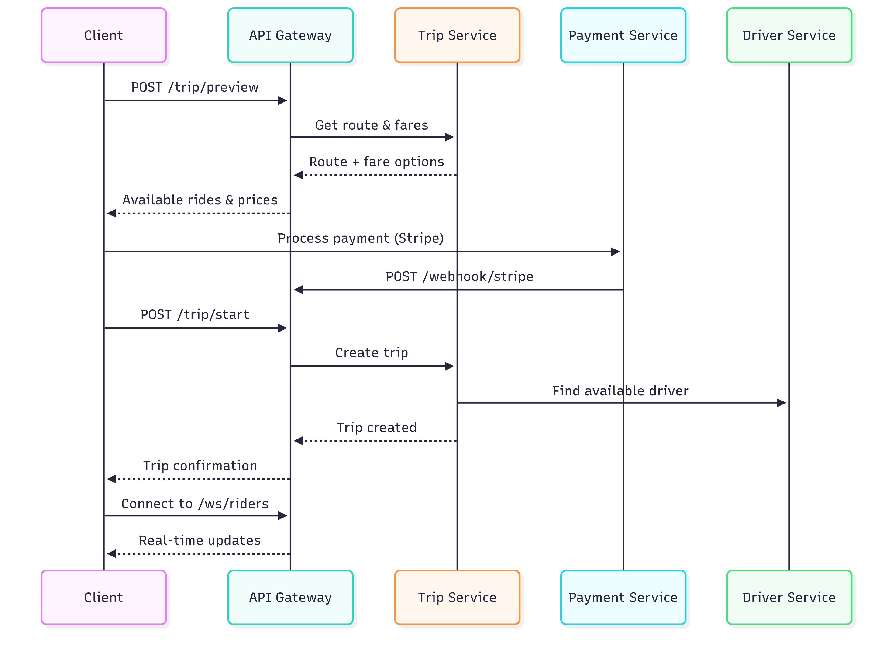

## Bolt app microservices

This is the backend for a mobile and web application for ride-sharing services, built using event-driven distributed microservices architecture, and deployed on Kubernetes.

Tech stack: Golang, RabbitMQ, Docker, k8s, Stripe, Tilt, Google Cloud, and Postgres

## Architecture

## Local dev flow

1. **Code**: You write Go code in `services/`
2. **Tilt watches** for file changes and automatically:
   - Generates Swagger docs (`make swagger-docs`)
   - Compiles Go binaries (`go build`)
   - Builds Docker images (`docker_build_with_restart`)
   - Deploys to Minikube using `deploy/development/k8s/` manifests
3. **Hot reloading**: Tilt syncs changes without full rebuilds
4. **Local testing**: Access services via port forwards (API Gateway: 8081, Swagger UI: 8082, etc.)

## Production deployment flow

1. **Push to Git** (main/production branch)
2. **CI/CD Pipeline** (GitHub Actions, GitLab CI, etc.) will:
   - Build production Docker images
   - Push to container registry (Docker Hub, ECR, GCR)
   - Deploy using `deploy/production/k8s/` manifests
3. **ArgoCD** for GitOps continuous deployment:
   - Monitors Git repository for changes
   - Automatically syncs Kubernetes manifests
   - Provides rollback and deployment history
   - Manages multi-environment deployments
4. **Production cluster** (EKS, GKE, or self-managed Kubernetes)

TODO:
- add users ms
- add go tools
- add argo cd